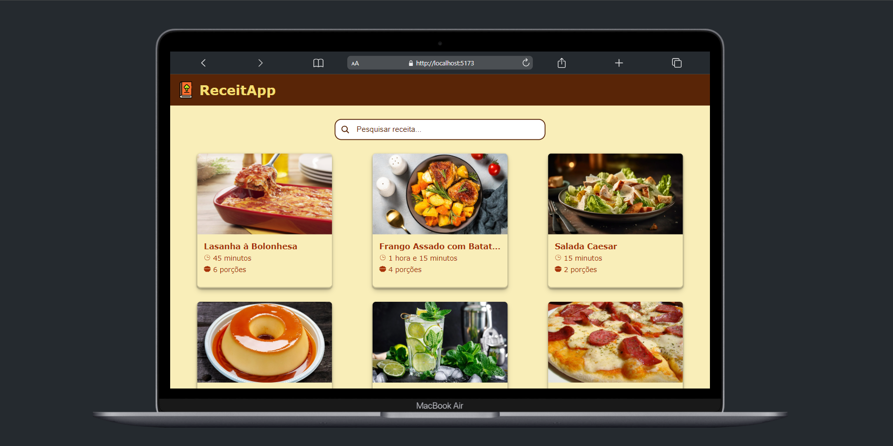

# ReceitApp

Este é um projeto de conclusão do módulo **[Front End Dinamico🔗](https://github.com/josephmatheus/vem-ser-tech-ifood/blob/main/modulo04-frontend-dinamico)** do curso Vem Ser Tech, um programa Ada Tech em parceria com o iFood.
O projeto consiste em uma plataforma web onde os usuários podem visualizar uma lista de receitas culinárias. Ele foi desenvolvido como parte do curso de React I.

## Screenshots 🖼

---

## Funcionalidades 📝

A aplicação "Pokédex React" oferece as seguintes funcionalidades:

1. **Página Inicial (/):**

   - Exibe uma lista de receitas culinárias em cards.
   - Cada card exibe a imagem da receita, título e breve descrição.
   - Os dados das receitas são estáticos vindo do JSON fornecido.

2. **Detalhes da Receita (/recipe/:id):**

   - Ao clicar em um card de receita, o usuário é redirecionado para esta página.
   - Exibe detalhes completos da receita selecionada, incluindo ingredientes, instruções de preparo, tempo de preparo, etc.
   - Utiliza o parâmetro de rota (:id) para identificar a receita selecionada.

3. **Campo de Busca:**

   - Permite que os usuários pesquisem receitas por nome ou categoria.
   - Implementar um formulário de busca e exibe os resultados abaixo, baseado se a as palavras buscadas aparece no titulo ou ingredientes da receita.
   - Utilizar recurso de gerenciamento de estado para controlar o campo de busca e resultados.

4. **Usa um arquivo JSON como dados para a aplicação**

## Ferramentas Utilizadas 🛠

As seguintes ferramentas foram escolhidas para o desenvolvimento deste projeto:

- **Linguagem de Programação:** TypeScript foi escolhido como a linguagem principal.
- **Biblioteca Front-End:** React.js foi utilizada para a criação da interface do usuário.
- **Estilização:** styled-components foi utilizado para estilizar os componentes.
- **Navegação:** react-router-dom foi usado para a navegação entre páginas.

## Decisões Adotadas 💡

Durante o planejamento e execução deste projeto, as seguintes decisões foram adotadas:

- **Arquitetura SPA:** A aplicação foi desenvolvida como uma Single Page Application (SPA) para proporcionar uma experiência de usuário mais fluida.
- **styled-components:** A estilização com styled-components permite uma melhor organização e modularização do código CSS.
- **Rotas com react-router-dom:** O uso do react-router-dom simplifica a navegação entre as páginas da aplicação.

## Como Rodar o Projeto Localmente 👨‍🔧

Para executar este projeto em seu computador local, siga estas etapas:

1. Clone este repositório:

   `git clone https://github.com/josephmatheus/vem-ser-tech-projeto-modulo05.git`

2. Navegue para o diretório do projeto:

   `cd vem-ser-tech-projeto-modulo05`

3. Instale as dependências do projeto:

   `npm install`

4. Inicie o servidor de desenvolvimento:

   `npm run dev`

5. Abra seu navegador e acesse <http://localhost:5173> para visualizar a aplicação.

## Licença 📝

Este projeto está licenciado sob a [**MIT License**](./LICENSE).
